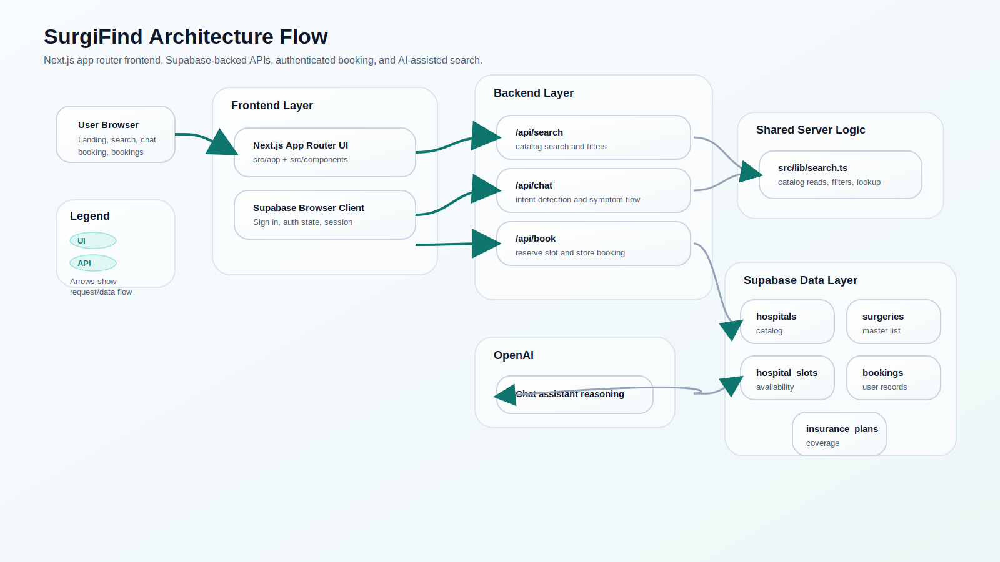
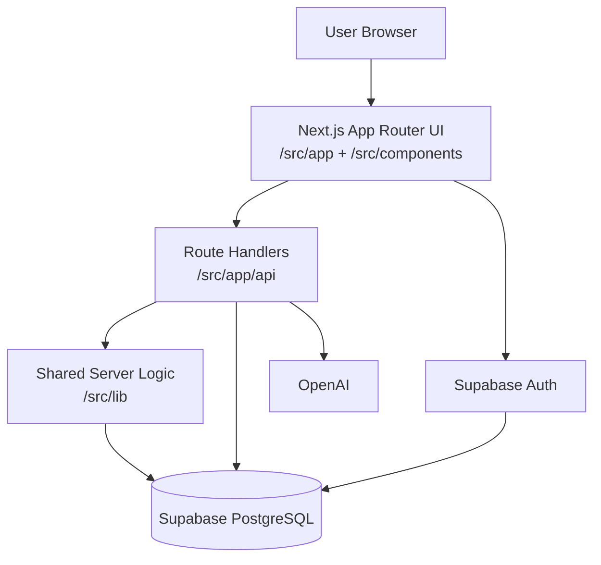
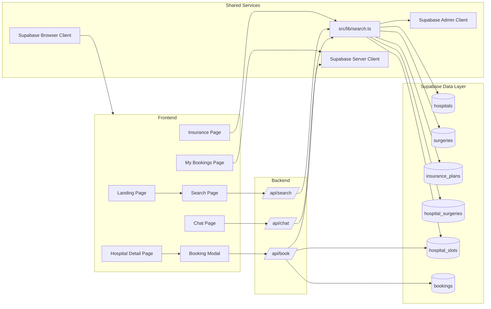
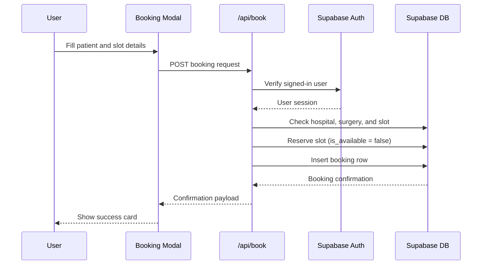

# SurgiFind Architecture Diagram

PNG version: [architecture-diagram.png](architecture-diagram.png)

## High-Level Flow

## Request Flow by Feature

## Booking Sequence

## Main Design Decisions
- Next.js App Router handles both UI and server routes in one codebase.
- Supabase stores auth, catalog, slots, and bookings.
- Server-side data access is centralized in src/lib/search.ts.
- Booking writes are protected by session validation and server-side Supabase access.
- The chat assistant can use OpenAI, but falls back to deterministic rules when needed.

## File Map
- [src/app](../src/app)
- [src/components](../src/components)
- [src/lib](../src/lib)
- [src/app/api/book/route.ts](../src/app/api/book/route.ts)
- [src/app/api/chat/route.ts](../src/app/api/chat/route.ts)
- [src/app/api/search/route.ts](../src/app/api/search/route.ts)
- [src/lib/search.ts](../src/lib/search.ts)
- [src/lib/supabase](../src/lib/supabase)
