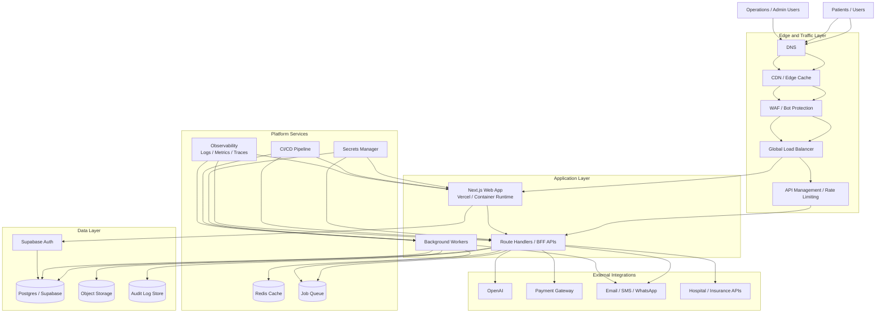

# SurgiFind Long-Run Architecture

This document describes the future-state production architecture for SurgiFind, extending the current hackathon implementation with cloud, devops, scale, and security components.

## Goals

- support higher user traffic reliably
- reduce latency for search and repeated reads
- improve abuse protection for public APIs
- support payment workflows safely
- strengthen auditability and operational visibility

## Current State Summary

The current application already includes:

- Next.js application with App Router
- route handlers for search, chat, and booking
- Supabase authentication
- Supabase PostgreSQL for operational data
- OpenAI integration for chat assistance

## Future-State Production Architecture

## Component Roles

### Edge and Traffic Layer

- `DNS`: directs traffic to the primary frontend entrypoint.
- `CDN / Edge Cache`: accelerates static assets and cacheable public content.
- `WAF / Bot Protection`: blocks obvious abusive traffic and basic attack patterns.
- `Global Load Balancer`: distributes traffic across healthy app instances or regions.
- `API Management`: enforces quotas, authentication rules, API versioning, and traffic shaping.

### Application Layer

- `Next.js Web App`: renders the UI and handles server-rendered experiences.
- `Route Handlers / BFF APIs`: encapsulate search, booking, payments, and orchestration logic.
- `Background Workers`: process async tasks such as notifications, retries, booking reconciliation, analytics rollups, and audit exports.

### Platform Services

- `Redis Cache`: caches search results, hospital catalogs, and rate-limit counters.
- `Job Queue`: decouples user-facing requests from async processing.
- `Secrets Manager`: stores API keys, payment credentials, and service tokens securely.
- `Observability`: centralizes logs, metrics, tracing, dashboards, and alerting.
- `CI/CD Pipeline`: automates build, test, security checks, deployment, and rollback.

### Data Layer

- `Supabase Auth`: user identity and session management.
- `Postgres / Supabase`: source of truth for hospitals, slots, bookings, plans, and users.
- `Object Storage`: stores exported reports, assets, attachments, or generated documents.
- `Audit Log Store`: immutable event trail for sensitive actions.

### External Integrations

- `OpenAI`: conversational assistant and intent interpretation.
- `Payment Gateway`: consultation deposits, booking confirmation payments, refunds, and receipts.
- `Email / SMS / WhatsApp`: confirmations, reminders, and operational notifications.
- `Hospital / Insurance APIs`: future sync of slot inventory, plan coverage, and booking reconciliation.

## Recommended Runtime Path

### Near Term

- deploy web and APIs on Vercel
- keep Supabase as the managed auth + database layer
- add managed Redis for caching and rate limiting
- add Sentry or similar for error monitoring

### Growth Stage

- move heavy background tasks to dedicated workers
- add an API management layer in front of sensitive endpoints
- use queue-driven notifications and reconciliation jobs
- introduce read caching for search-heavy flows

### Mature Stage

- multi-region traffic routing where needed
- stronger audit and compliance workflows
- hospital-side admin and integration platform
- payment ledger and financial reconciliation controls

## Security and DevOps Additions

- secrets stored in a managed secrets system, never in code
- environment isolation across dev, preview, and production
- WAF and rate limiting in front of public APIs
- CI checks for lint, type safety, dependency hygiene, and build integrity
- structured logging for user actions and booking state changes
- role-based access for admin operations
- backup and recovery procedures for data services

## Payment System as the Next Major Milestone

Suggested payment flow:

1. User confirms consultation or surgery booking intent.
2. API creates payment order with provider.
3. User completes payment on hosted checkout or secure embedded flow.
4. Webhook confirms payment success.
5. Booking status updates to `paid` or `deposit_received`.
6. Notification service sends receipt and confirmation.

Why this matters:

- reduces drop-off after booking intent
- improves commitment quality for hospitals
- unlocks monetization and reconciliation workflows

## Suggested Shareable Assets

- pitch narrative: [pitch-deck.md](./pitch-deck.md)
- current architecture: [architecture-diagram.md](./architecture-diagram.md)
- future-state architecture: this document